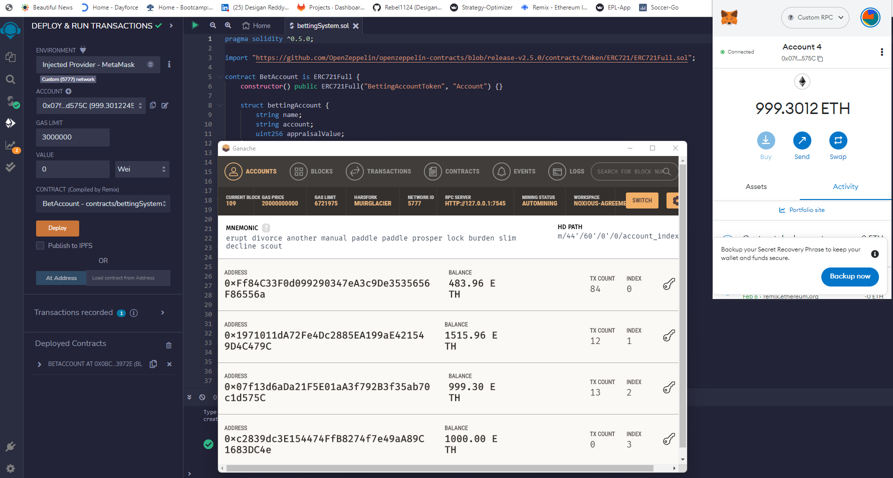
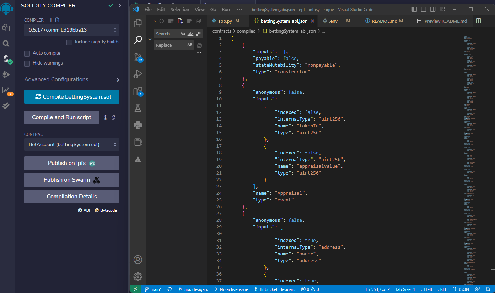
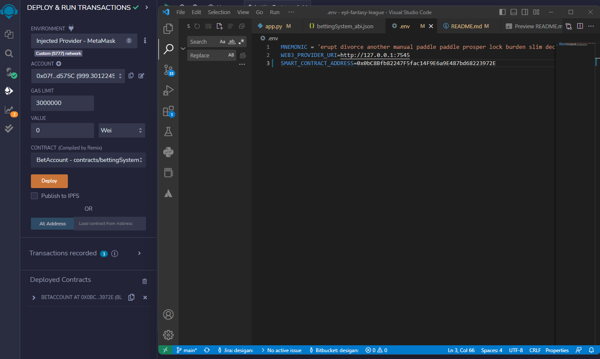
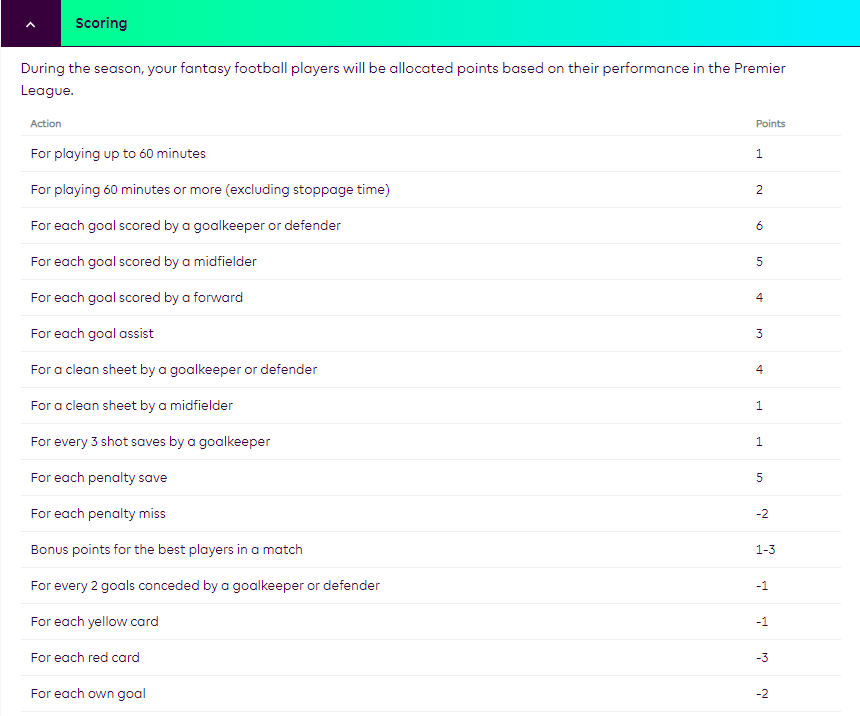

 # **UTOR: FinTech Bootcamp - Project 3**

**English Premier League Analysis and Betting App**
=======

## **Research Question**

Can Fantasy Premier League player statistics be used to make predictions of soccer match outcomes?

---
## **Abstract**

Using Fantasy Premier League player performance metrics, feature variables were constructed and used in a K-Means and PCA K-Means clustering algorithm to group players according to how impactful they are their eam and to a match outcome. Using z-scores players were ranked and grouped according to their percentile.

In addition the same zscores were used to score players. Using this along with the most likely starting eleven team scores were calculated and used in a possion model to determine the most probable outcome of football matches between two chosen teams.

Further to this, the project also utilized streamlit to build a front-end interface were users could select various team and player descriptive and graphical statistics. And as a bonus, a prototype of a betting system/account was incorportated into app. This served show case a typical betting platform BUT made using smart contracts and crypto wallets.

The final product is a proof of concep of a possible English Premier League Analysis app and betting tool.

---
## **Background**

    

The Premier League represents the highest tier of English Football. It consists of the top 20 teams with each team playing each other home and away over the season. Teams are awarded 3 points for a win, 1 point for a draw and 0 points for a loss. 

The English Premier league is one of the richest leagues in the world and typically attracts some of the most popular and high profile players and managers in the game. 

According to wikipeadia, it is the most watched sports league in the world, broadcast in 212 territories to 643 million homes with a potential TV audience of 4.7 billion people! Needless to say it an established and well recognized brand globally! 

---
## **Technologies Used**

1. Python
2. Pandas
3. Numpy
4. Plotly
5. Streamlit
6. Sklearn
7. Scipy.stats
8. web3
9. Ganache
10. Remix
11. Meta Mask
12. Jupyter Notebook

 

---
## **App Setup**

Before running the streamlit app, make sure firstly, you have Ganache, Remix and MetaMask open and that your Ganache ethereum wallet is connected to MetaMask.

    

 

Once connected you can copy the code from the BettingSystem.sol (contracts folder) onto Remix. This is the samrt contract for our betting app and after deploying, you can copy the json abi into the bettingSystem_abi file (compiled folder).

    

 

Thereafter you can go to the deploy section on Remix and select the Injected Provider - MetaMask environment. Next you can select the BettingSystem contract and deplot it. If it is done correctly, MetaMask should open and ask to confirm paying the gas fees.

Once this is done you can copy the contrac address into the .env file in the root folder. Also ensure that MNEMONI and WEB3_PROVIDER_URI details matches your Ganache environment or workspace.

    

 

Once this is done, you can then open gitbash or command prompt. Activate your dev environment if required and therafter navigate to the project folder. Once you are in the folder (and all the steps above have been completed), you can enter "streamlit run app.py" in your terminal and teh app should open pomptly!

 

---
## **Data Collection**

Data was collecting from two sources, namely:

1. https://www.football-data.co.uk/englandm.php - For Historical Match Results

2. https://fantasy.premierleague.com/api/bootstrap-static/ - Fantasy Premier League API for Player Statistics

The first source allowed me to download csv files of historical season match results (Data folder) and the second source enables me to retrieve player statistics via the fantasy premier league API. Players scores were calculated by the Fanatsy league and updated weekly. A schedule of players score points per game is shown below:

    

 

---
## **Data Cleaning and Pre-processing**

 

### CSV Files (Historical Match Data)

after saving the files in the Data folder for each season, code was written to import the data from each file into a dataframe. the contents for each season were contactenated into a single dataframe and required cleaning of the date formats. After this several other metrics were calculated (although not used in the final app) and afterwards the complete dataset was saved as three files, namely:

- merged_stats
- seasons
- team_merged

all of these files were then loaded into the final streamlit app and used in the different application sections which were: Team Analysis, Team Comaprison and Head to Head.

 

### Fantasy Premier League API (Player Statistics)

The data retrieved from the API was essentially clean data and consisted of the aggregate player statistics. As such no data cleaning was required for this data source. However code was written to further synthesize the data in feature variables which is dicussed in further detail below. After generated the features and player z-scores the dataframe was then saved into the elements file (csv file) and used in the streamlit app as well as the K-Means and PCA KMeans clustering algorithms. 

 

## **Analysis**

For my analysis, I followed the following steps:

- From the player statistics obtained, I created feature variables for the player form, cost, points, bonus points and ICT Index (Influence, Creativity and Threat). The points, bonus points and ICT Index were normalised by dividing by the games played (by the player), so effectively I calculated average player points, bonus points and ICT score per game. In addition, I also diveded these statistics by the cost of the player to similarly get the average points, bonus points and ICT score per unit cost of the players. From this Z-Scores of each feature variable for the player was calculated and added together, after which the score was transformed again by calculating min-max score and then working out the percentile rank of the player which was then used to classify the player as bronze, silver, gold or platinum. For this, I chose the percentiles as 50%, 80% and 97.5% meaning that players in the 50'th percentile and lower were given bronze status. Players between 50% and 80% were classified as silver. Similarly players between 80% and 97.5% were given gold status and the top 2.5% of players were categorised as platinum.

- Next Using these transformed (z-score) feature variables, I ran the features through a k-means and PCA k-means clustering algorithm. The results obtained striningsimilar to my percentile ranks and gave me some comfort that my workings were on the right track.

- After this, I then worked out what the fantasy dream team would look like. Since I had claculated player scores and knew the cost of the players, I found this to be an intriging optimization problem. The Fantasy League were such that I had to pick 11 players with more than three players coming from the same team. the total cost of the team cannot exceed 100 points and for my team I chose to have 1 GK, 4 defenders, 3 midfielders and 3 forwards (in reality you can choose a different formation but I went to with this formation for simplicity). To determine the dream team, I used random optimization and generated around 100,000 which followed the criteria as mentioned above. The team with highest score was then chosen as the dream team. You can see more on this in the jupyter notebook.

- Finally, to determine the probability of match outcomes. I worked out the most likely starting eleven for eah team and added the scores of the starting eleven players to get to a team score. The most likely eleven players was determined by looking at the most number of minutes played by players in a team. After calculating team scores, the chosen teams scores (i.e. teams selected to verse each by the user) would then be run through a poisson distibution model to determine the most likely score outcomes. This produced a matrix of possible scores and in determining the probability of outcome, I summed the probability of scores were team A won, similarly I summed the probability of scores where team B won and lastly the probability of scores that ended in a tie to derive the probabilities of match outcome. From this match odds were then calculated and used in the betting system (smart contract betting account and crypto contact). More details of each of the steps are outlined below:

 

## *Feature Variables*

Below is a list of the feature variables and how they were derived:

1) player form: p-form (current form of player over the last 30 days)

2) player cost: now-cost (current cost of player)

3) season points: value_season (this is the points accumulated by the player for the season so far divided by the value of the player which represents the average points generated by a player per unit cost)

4) season bonus points: value_bps (this is the bonus points accumulated by the player for the season so far divided by the value of the player which represents the average points generated by a player unit cost)

5) percentage players selected: selected_by_percent (this represents the percentage of fantasy league players that have selected this football player in their fantasy team)

6) season ICT points: ict_index_value (this represents the players accumulated ICT points for the season divided by the players value and represents the average points generated by the player per unit cost)

7) ICT points per game: ict_index_per_90 (this represents the players accumulated ICT points for the season divided by 90mins which determines the players average ICT score per game - ICT referes to the players Influence, Creativity and Threath posed in games)

8) Bonus points per game: bps_per_90 (This represents the players accumulated bonus points for the season divided by games played and respresents the players average bonus points per game).

9) Points per game: points_per_game (This respresents teh players accumulated points for the season divided by games played and represents the players average points per game)

 

## *Z-Scores and Player Rank*

Following the contruction each of the feature variables, the zscores of each player was calculated. Negative Z-Scores were assigned a score of zero (so the floor was set at zero) as the objective was to identify players that were above average and not to penalize players below average for a particular feature.

After calulcating the z-scores for each of the feature variables, we then added the scores for each player after which we standardize the scores by dividing each players score by the maximum - so each player will have a score between 0 and 1.

To be consistent I also normalized the standardized scores (i.e. calculated z-scores again) to get to the final player score.

After obtaining the scores players, the percentile rank for each player was then calculated and thereafter based on the percentile rank, players ere then categorized as either being a bronze, silver, gold or platinum player with lower ranked players being categorized as bronze and higher ranked players as platinum.

 

## *K-Means and PCA K-Means clsutering*

Following the z-score player rankings from above. As a check/confirmation the same z-score feature variables were run through the k-means and PCA-kmeans clustering models with clusters of both models compared to our z-score classification. Results of this are shown below:

### *K-Means*

    

 

### *PCA K-Means*

    

 

As can be seen the results from both clustering models are fairly similar to player categorisation obtained from my z-score percentile ranking method and gave me some comfort that my approach taken was reasonable.

 

## *Dream Team*

Next, an interesting question I wanted to answer was given the player scores and cost what would the optimal dream team look like? The approach followed to determine the team is outlined above results of this is shown below:

 

    

 

Our Optimization analysis shows that the greatest team strenghth comes out at 5.6 and was obtained by the 44,190 team selected from our random team generator with the team cost coming out at 99.16 points with the players selected in the team shown above.

 

Below is the plot of the teams generated (an serves as a form of efficient frontier) with the optimal team highlighed in blue. Also shown is a histogram for the distribution of team scores.

 

    

    

 

## **Match Prediction**

For match predictions, as mentioned earlier, team scores were passed through a poisson model which was used to calculate the probabilty of match scores. Probabilities for the home team winning were summed and similarly the probability of away teams winning were summed as well as the probabilities for matches that ended in a tie. The below image provides a graphical depiction of the poission match matrix and the corresponding probability of match resulst for a home team with strength 2.41 and away team with strength 3.12. We see from the below that the probability of the away team winning is 53.25 and equates to fair match odds of 1.88. Similarly the probability of a draw was 16.69% with fair odds of 5.98 and the probability of the home team winning was 30.1% with odds of 3.32.

Functions for this (match probability calculator) were written in the streamlit app and gave the users choice as to the teams to calculate probabilities for. So in addition to the player and team analysis provided, users could also dynamically work out (using the method above) the probability of a particular match outcome.

 

### *Excel Poisson Distribution Model*

    

 

Below we see an example of a match prediction between Manchester United vs. Liverpool. The team scores were 2.12 and 1.55 respectively and generated match probabilities of 50.86% (Man United win), 20.9% (Draw) and 28.24% (Liverpool win) which worked out to fair match odds of 1.97, 4.79 and 3.54 respectively.

 

### *App Match Outcome Demo (Manchester United vs. Liverpool)*

    

 

## **Smart Contract Betting Account and Crypto Wallet**

For the betting account smart contract, I made use of Ganache, Remix and MetaMask. After writing the solidity code for the betting account smart contract (see code in contracts folder). The code was compiled and then deployed on remix using the Injected Provider - MetaMask wallet (which is connected to Ganache wallets via the Custom RPC).

The app has a clean user interface for customers and is structured as follows:

 

Clients enter details for account take-on (betting account take-on) - including wallet address. As this was a prototype or proof of concept only one wallet address for selected for demo purposes although it is easy to add more.

    

After registering, clients can deposit ether into their account.

    

Once funds are available clients can place bets on matched. Match probabilities and odds are shown in the match sumulation section.
Clients are also able to withdaraw funds, which will be sent to their Ganache wallet address.

    

Lastly clients are able to view a history of their betting account transactions on the blockchain viw the events log.

    

 

---
## **Conclusion**

Finally, although our model match outcome probabilities were comparable to actual match odds (made by sports books), I do believe that the model build can definitly be improved on and enhanced. A few ways to do this would be:

- Incorporate player and team chemistry into team scores.
- Account for winning streaks by teams (which may or may not improve team scores).
- Adjust for manager styles.
- Adjust for weather conditions that may favour a certain team.
- Use player ststistics from past several games (as opposed to season aggregate scores) to better identify in-form players and teams.

These are just a few of the metrics that one could use to improve the model. Having said that, the results tha far have been relatively solid and comparable to the market and provides a sound foundation on which to build on for future work - which I was really please with!!!

 

---
## **Postmortem**

This was a really involved propject that incorportated a lot of components from machine learning to smart contracts and I was really happy with the final result. Looking back I think I could have improved or done better on the following:

1. Looking at incorporating other clustering models into the analysis.
2. Provided some (or more) descriptions on the app in the front-end that help the end use use the product better.
3. Used more crypto wallets for the betting account (instead of just one as a proof of concept).
4. Made us of streamlit cache function (st.cache) to store betting account balances. I spent several hours trying to get this right but could not do so and in the end used a text file to keep track of account balances. And although it is acknowledged that this is not ideal, I think for demo purposes and as a proof of concept it was reasonable to use.

 

---
## **References**

1. https://www.football-data.co.uk/englandm.php
2. https://towardsdatascience.com/fantasy-premier-league-value-analysis-python-tutorial-using-the-fpl-api-8031edfe9910
3. https://towardsdatascience.com/looping-through-the-fantasy-premier-league-api-element-summary-endpoint-to-download-player-df4ab5151fcb
4. https://www.amazon.com/Statistical-Sports-Models-Excel-Andrew-ebook/dp/B07SPWLYQJ/ref=sr_1_1?crid=33N59GU8F4FMG&keywords=sports+betting+models&qid=1675869191&sprefix=sports+betting+models%2Caps%2C85&sr=8-1
5. https://www.amazon.com/Predict-Football-Matches-Spreadsheet-Winning-ebook/dp/B00DHX0QG0/ref=sr_1_7?crid=1R8A0Z9OVEGO4&keywords=english+soccer+prediction+models&qid=1675869224&sprefix=english+soccer+prediction+models%2Caps%2C81&sr=8-7
6. https://en.wikipedia.org/wiki/Premier_League

